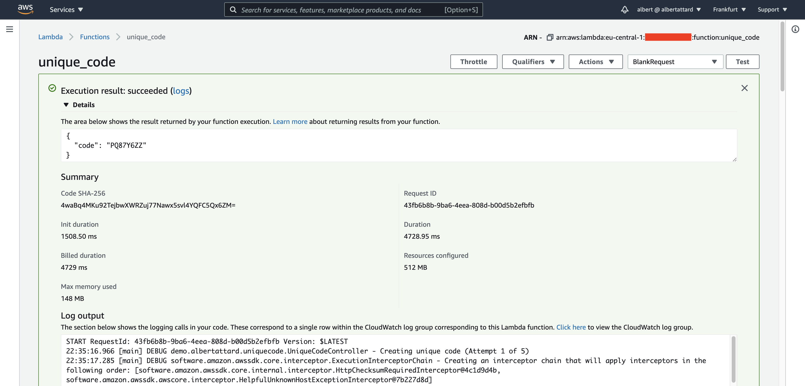
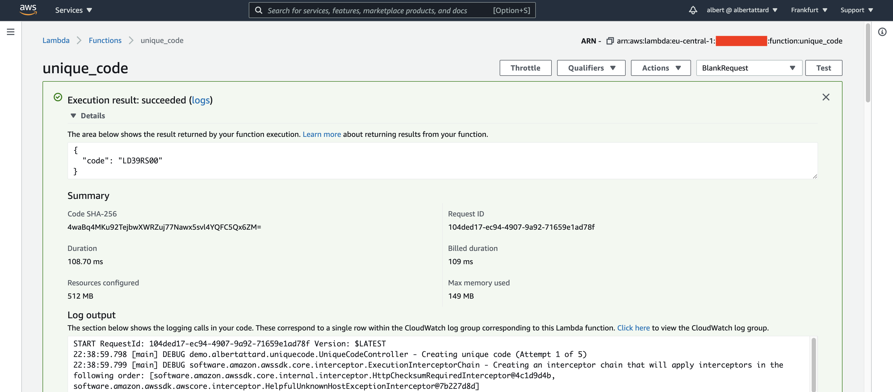
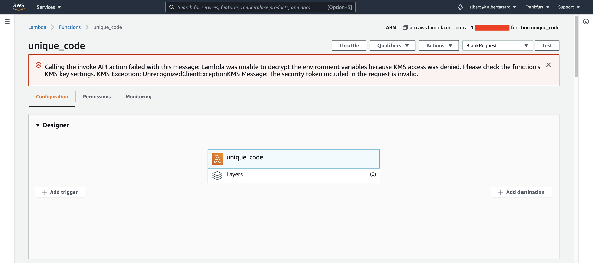
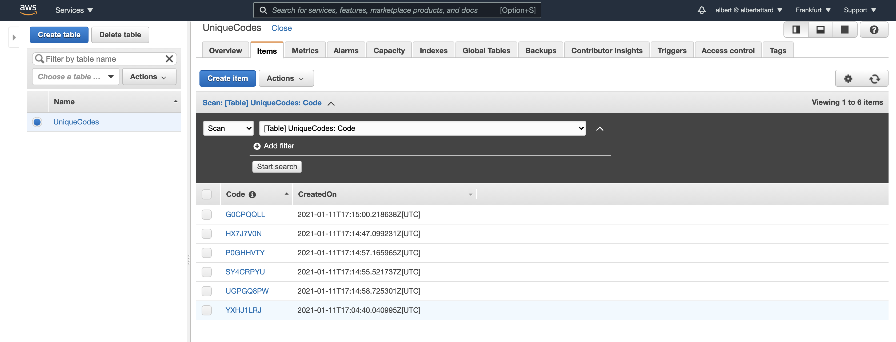

# Unique Code Serverless Application

A serverless application that uses AWS Lambda Functions and DynamoDB to create unique code that can be used to identify entities within an application. The serverless application features the following technologies.

1. Java 11
1. Gradle
1. AWS Lambda Functions
1. DynamoDB

**Note that this demo does not use any frameworks**.

## Conclusion

Pending

Still need to setup integration tests.

## Useful resources

- [https://docs.aws.amazon.com/lambda/latest/dg/java-handler.html](https://docs.aws.amazon.com/lambda/latest/dg/java-handler.html)

## Commands

1. Build application

   ```console
   $ ./gradlew clean test shadowJar
   ```

1. Set the AWS profile that will be used

   ```console
   $ export AWS_PROFILE="albertattard-demo"
   ```

   The above profile only has the following policy attached.

   ```json
   {
     "Version": "2012-10-17",
     "Statement": [
       {
         "Sid": "DemoDynamoDbFullAccess",
         "Effect": "Allow",
         "Action": ["dynamodb:*"],
         "Resource": "arn:aws:dynamodb:eu-central-1:000000000000:table/UniqueCodes"
       },
       {
         "Sid": "DemoIamFullAccessIamRole",
         "Effect": "Allow",
         "Action": ["iam:*"],
         "Resource": "arn:aws:iam::000000000000:role/DemoUniqueCodeLambdaFunction"
       },
       {
         "Sid": "DemoIamFullAccessIamPolicy",
         "Effect": "Allow",
         "Action": ["iam:*"],
         "Resource": "arn:aws:iam::000000000000:policy/DemoUniqueCodeLambdaFunctionRestrictedAccess"
       },
       {
         "Sid": "DemoLambdaFullAccessLambda",
         "Effect": "Allow",
         "Action": ["lambda:*"],
         "Resource": "arn:aws:lambda:eu-central-1:000000000000:function:unique_code"
       },
       {
         "Sid": "DemoLogsFullAccessLogs",
         "Effect": "Allow",
         "Action": ["logs:*"],
         "Resource": "arn:aws:logs:eu-central-1:000000000000:log-group:/aws/lambda/unique_code:*"
       },
       {
         "Sid": "DemoLogsRestrictiveAccessLogs",
         "Effect": "Allow",
         "Action": ["logs:DescribeLogGroups"],
         "Resource": "arn:aws:logs:eu-central-1:000000000000:log-group::log-stream:"
       }
     ]
   }
   ```

   Please note that the account id is masked `000000000000` and needs to be replaced by a valid account id.

   The policy grants admin access to the resources used by this demo. Further restrictions can be applied, but it's beyond the scope of this demo.

1. Verify access to AWS console

   List all DynamoDB Tables

   ```console
   $ aws dynamodb list-tables
   ```

   I have no tables available

   ```json
   {
     "TableNames": []
   }
   ```

1. Create the infrastructure

   Initialize the environment if not already done.

   ```console
   $ terraform init
   ```

   Apply the changes

   ```console
   $ terraform apply
   ```

   The following error may appear when applying the changes for a subsequent time, due to a known problem.

   ```text
   Error: error updating DynamoDB Table (UniqueCodes) time to live: error updating DynamoDB Table (UniqueCodes) Time To Live: ValidationException: TimeToLive is already disabled
   status code: 400, request id: 9HOFPEUK893E8PM15B388LSGC3VV4KQNSO5AEMVJF66Q9ASUAAJG
   ```

   This seems to be a known issue and nothing to worry about ([reference](https://github.com/hashicorp/terraform-provider-aws/issues/10304)).

1. Configure the Lambda test event

   Create a test template, if one does not already exist.

   Select the _Amazon API Gateway AWS Proxy_ (`apigateway-aws-proxy`) template and update it as shown next. No need to modify the `headers`.

   ```json
   {
     "body": "{}",
     "resource": "/",
     "path": "/",
     "httpMethod": "POST",
     "isBase64Encoded": false,
     "queryStringParameters": {},
     "multiValueQueryStringParameters": {},
     "pathParameters": {},
     "stageVariables": {},
     "headers": {
       "Accept": "text/html,application/xhtml+xml,application/xml;q=0.9,image/webp,*/*;q=0.8",
       "Accept-Encoding": "gzip, deflate, sdch",
       "Accept-Language": "en-US,en;q=0.8",
       "Cache-Control": "max-age=0",
       "CloudFront-Forwarded-Proto": "https",
       "CloudFront-Is-Desktop-Viewer": "true",
       "CloudFront-Is-Mobile-Viewer": "false",
       "CloudFront-Is-SmartTV-Viewer": "false",
       "CloudFront-Is-Tablet-Viewer": "false",
       "CloudFront-Viewer-Country": "US",
       "Host": "1234567890.execute-api.eu-central-1.amazonaws.com",
       "Upgrade-Insecure-Requests": "1",
       "User-Agent": "Custom User Agent String",
       "Via": "1.1 08f323deadbeefa7af34d5feb414ce27.cloudfront.net (CloudFront)",
       "X-Amz-Cf-Id": "cDehVQoZnx43VYQb9j2-nvCh-9z396Uhbp027Y2JvkCPNLmGJHqlaA==",
       "X-Forwarded-For": "127.0.0.1, 127.0.0.2",
       "X-Forwarded-Port": "443",
       "X-Forwarded-Proto": "https"
     },
     "multiValueHeaders": {
       "Accept": [
         "text/html,application/xhtml+xml,application/xml;q=0.9,image/webp,*/*;q=0.8"
       ],
       "Accept-Encoding": ["gzip, deflate, sdch"],
       "Accept-Language": ["en-US,en;q=0.8"],
       "Cache-Control": ["max-age=0"],
       "CloudFront-Forwarded-Proto": ["https"],
       "CloudFront-Is-Desktop-Viewer": ["true"],
       "CloudFront-Is-Mobile-Viewer": ["false"],
       "CloudFront-Is-SmartTV-Viewer": ["false"],
       "CloudFront-Is-Tablet-Viewer": ["false"],
       "CloudFront-Viewer-Country": ["US"],
       "Host": ["0123456789.execute-api.eu-central-1.amazonaws.com"],
       "Upgrade-Insecure-Requests": ["1"],
       "User-Agent": ["Custom User Agent String"],
       "Via": [
         "1.1 08f323deadbeefa7af34d5feb414ce27.cloudfront.net (CloudFront)"
       ],
       "X-Amz-Cf-Id": [
         "cDehVQoZnx43VYQb9j2-nvCh-9z396Uhbp027Y2JvkCPNLmGJHqlaA=="
       ],
       "X-Forwarded-For": ["127.0.0.1, 127.0.0.2"],
       "X-Forwarded-Port": ["443"],
       "X-Forwarded-Proto": ["https"]
     },
     "requestContext": {
       "accountId": "123456789012",
       "resourceId": "123456",
       "stage": "prod",
       "requestId": "c6af9ac6-7b61-11e6-9a41-93e8deadbeef",
       "requestTime": "09/Apr/2015:12:34:56 +0000",
       "requestTimeEpoch": 1428582896000,
       "identity": {
         "cognitoIdentityPoolId": null,
         "accountId": null,
         "cognitoIdentityId": null,
         "caller": null,
         "accessKey": null,
         "sourceIp": "127.0.0.1",
         "cognitoAuthenticationType": null,
         "cognitoAuthenticationProvider": null,
         "userArn": null,
         "userAgent": "Custom User Agent String",
         "user": null
       },
       "path": "/prod/path/to/resource",
       "resourcePath": "/{proxy+}",
       "httpMethod": "POST",
       "apiId": "1234567890",
       "protocol": "HTTP/1.1"
     }
   }
   ```

   

1. Run the Lambda test

   The first time Lambda is executed will take about 10 seconds as the Lambda function is being prepared.

   

   Subsequent tests will run faster.

   

   There can be cases where the lambda function fails to run, such as

   ```text
   Calling the invoke API action failed with this message: Lambda was unable to decrypt the environment variables because KMS access was denied. Please check the function's KMS key settings. KMS Exception: UnrecognizedClientExceptionKMS Message: The security token included in the request is invalid.
   ```

   

   or

   ```text
   Calling the invoke API action failed with this message: The role defined for the function cannot be assumed by Lambda.
   ```

   

   I never got to the bottom of this, but usually works when I modify the code slightly and redeploy.

1. View the data in DynamoDB

   

1. Cleanup resources from AWS

   When done, it is a good idea to delete any resources from AWS that are not required any more.

   ```console
   $ terraform destroy
   ```

   Once completed, double check through the AWS console to make sure that all the resources, including the logs were deleted.

## Performance

| Measurement          | 1st Request | 2nd Request | 3rd Request | 4th Request | 5th Request |
| -------------------- | ----------: | ----------: | ----------: | ----------: | ----------: |
| Init duration        |  4790.86 ms |           - |           - |           - |           - |
| Duration             |  5816.10 ms |   558.67 ms |   265.77 ms |    67.72 ms |   108.70 ms |
| Billed duration      |  5817.00 ms |   559.00 ms |   266.00 ms |    69.00 ms |   109.00 ms |
| Resources configured |      512 MB |      512 MB |      512 MB |      512 MB |      512 MB |
| Max memory used      |      211 MB |      149 MB |      149 MB |      149 MB |      149 MB |
