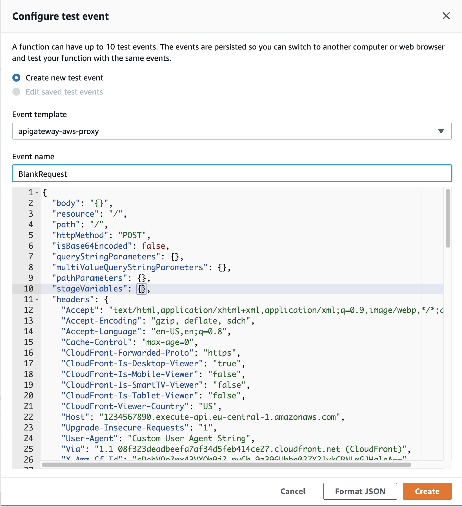
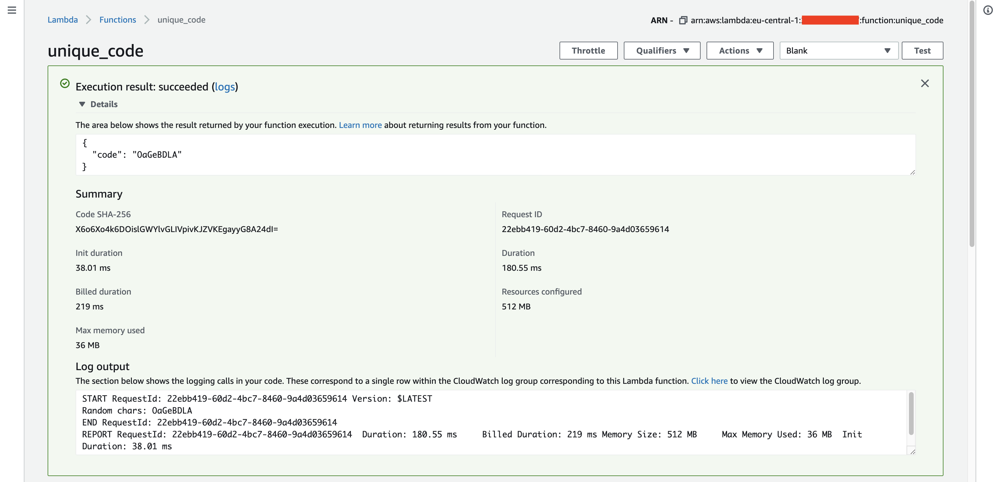
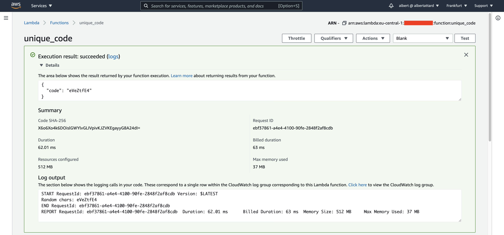
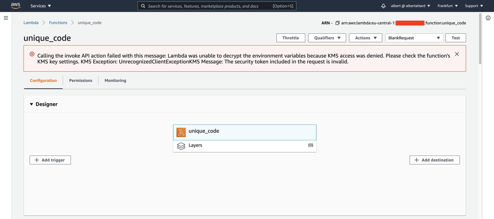
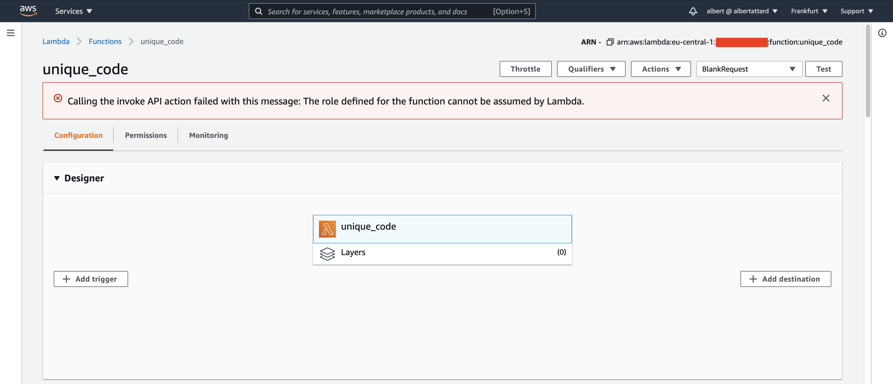
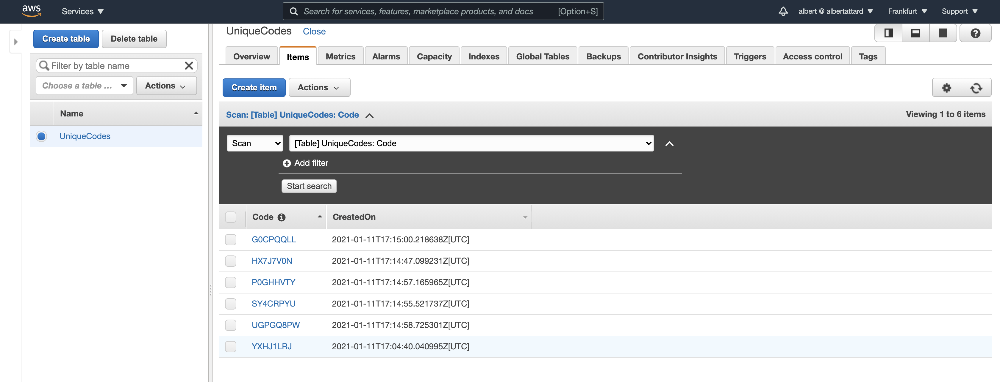

# Unique Code Serverless Application

A serverless application that uses AWS Lambda Functions and DynamoDB to create unique code that can be used to identify
entities within an application. The serverless application features the following technologies.

1. Rust 1.50
1. AWS Lambda Functions
1. DynamoDB

**Note that this demo does not use any frameworks**.

I have no Rust skills, and the code shown here may not be production ready. Please don't use as is.

## Conclusion

Pending

## Useful resources

- [https://aws.amazon.com/blogs/opensource/rust-runtime-for-aws-lambda/](https://aws.amazon.com/blogs/opensource/rust-runtime-for-aws-lambda/)
- [https://doc.rust-lang.org/edition-guide/rust-2018/platform-and-target-support/musl-support-for-fully-static-binaries.html](https://doc.rust-lang.org/edition-guide/rust-2018/platform-and-target-support/musl-support-for-fully-static-binaries.html)

## Commands

1. Build application

   Initially I tried to use cross compiler to compile the code that can be deployed as AWS lambda. This did not work out
   and was giving me issues. An alternative option was to use Docker to build the code instead. Created a simple docker
   image (`plain-rust1_50/builder/Dockerfile`) that builds the application and creates a ZIP file
   at `plain-rust1_50/target/x86_64-unknown-linux-musl/release/bootstrap.zip`. Then I use terraform to deploy this file
   on AWS.

   Build the container. Only need to do it once as this is simply creating an image that will be used to compile the
   application.

   ```console
   $ docker build . -f builder/Dockerfile -t plain-rust1_50-builder:local
   ```

   Run the image to compile and build the project.

   ```console
   $ docker run --rm \
     -v "$(pwd):/home/rust/src" \
     -v "${HOME}/.cargo/registry:/home/rust/.cargo/registry" \
     -v "${HOME}/.cargo/git:/home/rust/.cargo/git" \
     -it plain-rust1_50-builder:local
   ```

   I am mounting several directories to cash artefacts from previous builds, speeding up following builds. For
   convenience, there is a `build.sh` script which simply runs the above command.

   ```console
   ./build.sh
   ```

1. Set the AWS profile that will be used to deploy the lambda function.

   Note that the lambda function has tighter access control as it only allowed access to specific resources, such as the
   DynamoDB table being used. Please refer to the [`terraform/main.tf` terraform script](terraform/main.tf) for more
   information about this.

   Set the profile to be used to deploy the lambda function

   ```console
   $ export AWS_PROFILE="albertattard-demo"
   ```

   The above profile only has the following policy attached.

   ```json
   {
     "Version": "2012-10-17",
     "Statement": [
       {
         "Sid": "DemoDynamoDbListAllTables",
         "Effect": "Allow",
         "Action": ["dynamodb:ListTables"],
         "Resource": "arn:aws:dynamodb:eu-central-1:000000000000:table/*"
       },
       {
         "Sid": "DemoDynamoDbFullAccess",
         "Effect": "Allow",
         "Action": ["dynamodb:*"],
         "Resource": "arn:aws:dynamodb:eu-central-1:000000000000:table/UniqueCodes"
       },
       {
         "Sid": "DemoIamFullAccessIamRole",
         "Effect": "Allow",
         "Action": ["iam:*"],
         "Resource": "arn:aws:iam::000000000000:role/DemoUniqueCodeLambdaFunction"
       },
       {
         "Sid": "DemoIamFullAccessIamPolicy",
         "Effect": "Allow",
         "Action": ["iam:*"],
         "Resource": "arn:aws:iam::000000000000:policy/DemoUniqueCodeLambdaFunctionRestrictedAccess"
       },
       {
         "Sid": "DemoLambdaFullAccessLambda",
         "Effect": "Allow",
         "Action": ["lambda:*"],
         "Resource": "arn:aws:lambda:eu-central-1:000000000000:function:unique_code"
       },
       {
         "Sid": "DemoLogsFullAccessLogs",
         "Effect": "Allow",
         "Action": ["logs:*"],
         "Resource": "arn:aws:logs:eu-central-1:000000000000:log-group:/aws/lambda/unique_code:*"
       },
       {
         "Sid": "DemoLogsRestrictiveAccessLogs",
         "Effect": "Allow",
         "Action": ["logs:DescribeLogGroups"],
         "Resource": "arn:aws:logs:eu-central-1:000000000000:log-group::log-stream:"
       }
     ]
   }
   ```

   Please note that the account id is masked `000000000000` and needs to be replaced by a valid account id.

   The policy grants admin access to the resources used by this demo. Further restrictions can be applied, but it's
   beyond the scope of this demo.

   Please note that the following policy is not required to deploy the lambda function and can be removed. It is only
   needed to test the connection to AWS by listing all DynamoDb tables.

   ```json
       {
         "Sid": "DemoDynamoDbListAllTables",
         "Effect": "Allow",
         "Action": ["dynamodb:ListTables"],
         "Resource": "arn:aws:dynamodb:eu-central-1:000000000000:table/*"
       }
   ```

1. Verify access to AWS console

   List all DynamoDB Tables

   ```console
   $ aws dynamodb list-tables
   ```

   I have no tables available

   ```json
   {
     "TableNames": []
   }
   ```

   Kindly note that for this command to work, the profile we are using need to be able to list the DynamoDb tables.

1. Create the infrastructure

   The following terraform commands needs to be executed from within the `terraform` directory.

   ```console
   $ cd terraform
   ```

   Initialize the environment if not already done.

   ```console
   $ terraform init
   ```

   Apply the changes

   ```console
   $ terraform apply
   ```

   The following error may appear when applying the changes for a subsequent time, due to a known problem.

   ```text
   Error: error updating DynamoDB Table (UniqueCodes) time to live: error updating DynamoDB Table (UniqueCodes) Time To Live: ValidationException: TimeToLive is already disabled
   status code: 400, request id: 9HOFPEUK893E8PM15B388LSGC3VV4KQNSO5AEMVJF66Q9ASUAAJG
   ```

   This seems to be a known issue and nothing to worry
   about ([reference](https://github.com/hashicorp/terraform-provider-aws/issues/10304)).

1. Configure the Lambda test event

   Create a test template, if one does not already exist.

   Select the _Amazon API Gateway AWS Proxy_ (`apigateway-aws-proxy`) template and update it as shown next. No need to
   modify the `headers`.

   ```json
   {
     "body": "{}",
     "resource": "/",
     "path": "/",
     "httpMethod": "POST",
     "isBase64Encoded": false,
     "queryStringParameters": {},
     "multiValueQueryStringParameters": {},
     "pathParameters": {},
     "stageVariables": {},
     "headers": {
       "Accept": "text/html,application/xhtml+xml,application/xml;q=0.9,image/webp,*/*;q=0.8",
       "Accept-Encoding": "gzip, deflate, sdch",
       "Accept-Language": "en-US,en;q=0.8",
       "Cache-Control": "max-age=0",
       "CloudFront-Forwarded-Proto": "https",
       "CloudFront-Is-Desktop-Viewer": "true",
       "CloudFront-Is-Mobile-Viewer": "false",
       "CloudFront-Is-SmartTV-Viewer": "false",
       "CloudFront-Is-Tablet-Viewer": "false",
       "CloudFront-Viewer-Country": "US",
       "Host": "1234567890.execute-api.eu-central-1.amazonaws.com",
       "Upgrade-Insecure-Requests": "1",
       "User-Agent": "Custom User Agent String",
       "Via": "1.1 08f323deadbeefa7af34d5feb414ce27.cloudfront.net (CloudFront)",
       "X-Amz-Cf-Id": "cDehVQoZnx43VYQb9j2-nvCh-9z396Uhbp027Y2JvkCPNLmGJHqlaA==",
       "X-Forwarded-For": "127.0.0.1, 127.0.0.2",
       "X-Forwarded-Port": "443",
       "X-Forwarded-Proto": "https"
     },
     "multiValueHeaders": {
       "Accept": [
         "text/html,application/xhtml+xml,application/xml;q=0.9,image/webp,*/*;q=0.8"
       ],
       "Accept-Encoding": ["gzip, deflate, sdch"],
       "Accept-Language": ["en-US,en;q=0.8"],
       "Cache-Control": ["max-age=0"],
       "CloudFront-Forwarded-Proto": ["https"],
       "CloudFront-Is-Desktop-Viewer": ["true"],
       "CloudFront-Is-Mobile-Viewer": ["false"],
       "CloudFront-Is-SmartTV-Viewer": ["false"],
       "CloudFront-Is-Tablet-Viewer": ["false"],
       "CloudFront-Viewer-Country": ["US"],
       "Host": ["0123456789.execute-api.eu-central-1.amazonaws.com"],
       "Upgrade-Insecure-Requests": ["1"],
       "User-Agent": ["Custom User Agent String"],
       "Via": [
         "1.1 08f323deadbeefa7af34d5feb414ce27.cloudfront.net (CloudFront)"
       ],
       "X-Amz-Cf-Id": [
         "cDehVQoZnx43VYQb9j2-nvCh-9z396Uhbp027Y2JvkCPNLmGJHqlaA=="
       ],
       "X-Forwarded-For": ["127.0.0.1, 127.0.0.2"],
       "X-Forwarded-Port": ["443"],
       "X-Forwarded-Proto": ["https"]
     },
     "requestContext": {
       "accountId": "123456789012",
       "resourceId": "123456",
       "stage": "prod",
       "requestId": "c6af9ac6-7b61-11e6-9a41-93e8deadbeef",
       "requestTime": "09/Apr/2015:12:34:56 +0000",
       "requestTimeEpoch": 1428582896000,
       "identity": {
         "cognitoIdentityPoolId": null,
         "accountId": null,
         "cognitoIdentityId": null,
         "caller": null,
         "accessKey": null,
         "sourceIp": "127.0.0.1",
         "cognitoAuthenticationType": null,
         "cognitoAuthenticationProvider": null,
         "userArn": null,
         "userAgent": "Custom User Agent String",
         "user": null
       },
       "path": "/prod/path/to/resource",
       "resourcePath": "/{proxy+}",
       "httpMethod": "POST",
       "apiId": "1234567890",
       "protocol": "HTTP/1.1"
     }
   }
   ```

   

1. Run the Lambda test

   The first time Lambda is executed may take upto 10 seconds as the Lambda function is being prepared.

   

   Subsequent tests will run faster.

   

   There can be cases where the lambda function fails to run, such as

   ```text
   Calling the invoke API action failed with this message: Lambda was unable to decrypt the environment variables because KMS access was denied. Please check the function's KMS key settings. KMS Exception: UnrecognizedClientExceptionKMS Message: The security token included in the request is invalid.
   ```

   

   or

   ```text
   Calling the invoke API action failed with this message: The role defined for the function cannot be assumed by Lambda.
   ```

   

   I never got to the bottom of this, but usually works when I modify the code slightly and redeploy.

1. View the data in DynamoDB

   

1. Cleanup resources from AWS

   When done, it is a good idea to delete any resources from AWS that are not required anymore.

   ```console
   $ terraform destroy
   ```

   Once completed, double check through the AWS console to make sure that all the resources, including the logs were
   deleted.

## Performance

| Measurement          | 1st Request | 2nd Request | 3rd Request | 4th Request | 5th Request |
| -------------------- | ----------: | ----------: | ----------: | ----------: | ----------: |
| Init duration        |    38.01 ms |           - |           - |           - |           - |
| Duration             |   180.55 ms |    37.09 ms |    44.82 ms |    48.20 ms |    37.39 ms |
| Billed duration      |   219.00 ms |    38.00 ms |    45.00 ms |    49.00 ms |    38.00 ms |
| Resources configured |      512 MB |      512 MB |      512 MB |      512 MB |      512 MB |
| Max memory used      |       36 MB |       36 MB |       36 MB |       36 MB |       36 MB |
